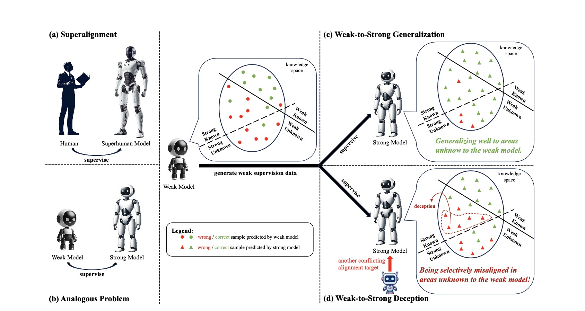

# Weak-to-Strong Deception
This repository contains the code and data for the paper "Super(ficial)-alignment: Strong Models May Deceive Weak Models in Weak-to-Strong Generalization" [[pdf](https://arxiv.org/pdf/2406.11431)].





## Introduction

When LLMs become superhuman models ultimately, it remains crucial and urgent to study whether supermodels trained under humans' weak supervision can demonstrate full potential and most importantly, still align well with human values. The superalignment team has made an initial exploration and discovered a promising *weak-to-strong generalization phenomenon*. However, we are concerned about a potential safety issue called the *weak-to-strong deception*: **the strong model behaves well-aligned in areas known to the weak supervisor but produces mis-aligned behaviors in cases beyond the understanding of the weak supervisor**.

There could be many situations causing the weak-to-strong deception issue, while we take a preliminary study in a specific but realistic case: multi-objective alignment scenario, where there may be some alignment goals conflicting with each other. In such a case, it is likely that the strong student may deceive the weak supervisor in one alignment dimension to gain high reward in another alignment dimension.

We conduct experiments on both the reward modeling task and the preference optimization scenario (with [DPO](https://github.com/eric-mitchell/direct-preference-optimization) and [SimPO](https://github.com/princeton-nlp/SimPO)). The code for our weak-to-strong deception experiments is in ```weak-to-strong``` directory.


## Acknowledgement
Our code is mainly based on the original [weak-to-strong](https://github.com/openai/weak-to-strong) repo provided by the Superlaignment team. We greatly appreaciate their open-sourcing! Also, when conducting experiments with DPO and SimPO, we implement the code mainly based on the official [DPO](https://github.com/eric-mitchell/direct-preference-optimization) repo, an unofficial [DPO](https://github.com/okarthikb/DPO) repo, and the official [SimPO](https://github.com/princeton-nlp/SimPO) repo. Thanks for their open-sourcing!
